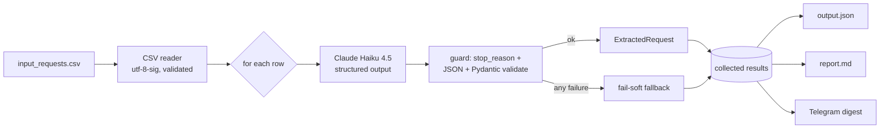

# Netpeak Request Triage

Classifies a free-form inbox of internal requests — Ukrainian and English, arriving via
Slack, Telegram and email — into a **strict, validated schema** using Claude Haiku 4.5,
then produces a structured `output.json` and a human-readable aggregate `report.md`. It
automates what is today a manual sorting step: for each incoming request, decide *what it
is about, which department it is from, how urgent it is, and what exactly is being asked.*

The input is deliberately messy — exact duplicates, a bare "thanks", out-of-scope hardware
procurement, multi-intent asks, terse one-liners, and bilingual mixing. Handling that
gracefully, and never crashing on a bad model response, is the core of the task.

## How it works



Each row is sent to Claude Haiku 4.5 with the Anthropic **structured-outputs** feature
(`output_config` → `json_schema`), which constrains generation to our schema. The response
is then guarded, parsed, and validated through Pydantic; **any** failure (a refusal, a
truncated response, malformed JSON, a validation error, or an API error) is turned into a
safe fallback record, so one bad row can never abort the batch and every input appears in
the output.

## Quick start

Requires Python 3.11+.

```bash
pip install -e .
cp .env.example .env          # then set ANTHROPIC_API_KEY

# classify the whole inbox -> output/output.json + output/report.md
python -m triage test-data/input_requests.csv

# cheap trial run on the first 3 rows
python -m triage test-data/input_requests.csv --limit 3

# inspect the CSV without calling the model (no API key needed)
python -m triage test-data/input_requests.csv --dry-run

# also send a summary to Telegram (needs TELEGRAM_* in .env)
python -m triage test-data/input_requests.csv --telegram
```

`triage <csv>` works too (installed as a console script). Output goes to `./output/` by
default (`--output-dir` to change).

### Configuration

All configuration is environment variables (loaded from `.env`); keys are never logged.

| variable | required | default | purpose |
| --- | --- | --- | --- |
| `ANTHROPIC_API_KEY` | yes | — | Anthropic API key |
| `ANTHROPIC_MODEL` | no | `claude-haiku-4-5` | generation model |
| `ANTHROPIC_MAX_TOKENS` | no | `1024` | per-request output cap |
| `TELEGRAM_BOT_TOKEN` | for `--telegram` | — | bot token from @BotFather |
| `TELEGRAM_CHAT_ID` | for `--telegram` | — | chat to post the digest to |
| `LOG_LEVEL` | no | `INFO` | logging verbosity |

### Docker

```bash
docker build -t netpeak-request-triage .
docker run --rm --env-file .env -v "$PWD/output:/app/output" netpeak-request-triage
# or: docker compose run --rm triage
```

The image bundles the sample CSV, so `docker run` works out of the box; mount `./output`
to retrieve the results.

## Output schema

Each request becomes one validated record. The six fields the task requires, plus four
extensions (see below):

| field | type | notes |
| --- | --- | --- |
| `category` | enum | автоматизація · інтеграція · звіт/аналітика · баг/підтримка · питання/консультація · поза скоупом |
| `target_department` | string \| null | requesting team, or null when not inferable |
| `priority` | enum | low · medium · high (from tone and content) |
| `short_summary` | string | one-sentence essence (Ukrainian) |
| `requested_actions` | string[] | concrete asks; 0 for a non-request, 2+ for multi-intent |
| `needs_clarification` | bool | too vague to action as-is |
| `language` | enum | uk · en · mixed |
| `confidence` | enum | low · medium · high |
| `secondary_category` | enum \| null | second intent for multi-intent requests |
| `is_actionable` | bool | real work vs. thank-you / FYI / out-of-scope |

### Why these four extensions

The schema was extended deliberately, not for completeness' sake:

- **`language`** — the corpus is genuinely bilingual (one request is an English body with a
  Ukrainian closing line). Detecting it is cheap and routes a request to a responder who
  can read it.
- **`confidence`** — pairs with `needs_clarification` to triage the terse one-liners
  ("треба бот", "нам би табличку якусь"). It is the model's *self-assessment*, so it is a
  weak signal — useful for sorting a review queue, not for automated decisions.
- **`secondary_category`** — some real requests carry two distinct deliverables (e.g. a
  daily monitoring digest **and** a negative-mention alert). Forcing a single label loses
  that; a nullable second category captures it without a schema rewrite.
- **`is_actionable`** — cleanly separates real work from a thank-you or an idea-with-no-ask,
  without abusing the category enum. It lets the report exclude noise from the actionable
  counts.

`reasoning` was considered and **cut**: it would add output tokens to every row, is never
aggregated, and invites the model to ramble (raising truncation risk). `short_summary`
plus `confidence` already carry enough traceability.

## Handling bad model output

Structured outputs guarantee the *shape* of a successful response, but the Anthropic API
can still return **HTTP 200 with non-conforming output** — a `stop_reason` of `refusal`
(empty content) or `max_tokens` (truncated, invalid JSON). The extractor handles every
failure mode and converts it into a fallback record (reserved category `не оброблено`,
`needs_clarification=true`, the reason captured in `error`):

| failure | how it is caught |
| --- | --- |
| refusal / unexpected `stop_reason` | checked before indexing into `content` |
| empty content block | guarded before access |
| truncated / malformed JSON | `json.loads` wrapped |
| valid JSON, wrong types/values | Pydantic `model_validate` |
| non-object JSON (array/scalar) | explicit type check |
| API error after SDK retries | `anthropic.APIError` caught |
| anything else | final `except Exception` |

The result: the batch always completes, and the fallback count surfaces in `report.md` and
the run summary. The fallback record is itself a valid `ExtractedRequest`, so it can never
fail its own validation.

## Evaluation

`test-data/golden.jsonl` hand-labels the requests whose classification is defensible, using
an **accept-set** for the genuinely ambiguous ones (so a reasonable disagreement is not
counted wrong). After a run, score the produced `output.json` offline — no extra API calls:

```bash
python -m triage.evaluation
```

Measured on the committed example run:

<!-- RESULTS: filled from the first live run before pushing -->
```
Scored 12 labeled rows.
  category          __/12 = __%
  priority          __/4  = __%
  is_actionable     __/8  = __%
```

## Where it breaks (limitations)

- **Invalid model output** — addressed above: every failure mode falls back to a valid
  record and is reported, never raised. The trade-off is that a fallback is a *non-answer*;
  at scale you would alert on the fallback rate and retry those rows.
- **Large volume** — processing is sequential (clear and easy to reason about at this
  size). For thousands of rows this is slow and leaves the discount on the table; the right
  move is `asyncio` with a concurrency cap, or the Anthropic **Message Batches API** (≈50%
  cheaper, async). The per-row extractor is already isolated, so this is a pipeline change,
  not a rewrite.
- **Non-determinism** — `temperature=0` is the most reproducible setting but not a
  guarantee; the ambiguous one-liners can flip between runs. `confidence` and
  `needs_clarification` flag exactly those rows for a human, and the golden set tracks drift.
- **Token cost** — Claude Haiku 4.5 at list price ($1 / MTok in, $5 / MTok out) costs a
  fraction of a cent per request; the full run is printed with its exact token count and an
  estimated dollar cost. The system prompt is re-sent per row — caching it (or batching)
  would cut input tokens materially at scale.

## What I would do next

- Cache the system prompt (`cache_control`) and/or move to the Batch API for volume.
- Async concurrency with a rate-limit-aware semaphore.
- Cross-row **semantic** de-duplication (an embedding pass) instead of the current
  same-department grouping, to merge requests like the two Google-Ads report asks.
- Optional Google Sheets output for non-technical reviewers.
- Expand the golden set and wire `triage.evaluation` into CI as a regression gate.

## Project layout

```
triage/         config · models · schema · prompts · extract · pipeline · report · telegram · cli · evaluation
tests/          unit + integration (mocked SDK; no network)
test-data/      input_requests.csv · golden.jsonl
examples/       a real output.json + report.md from the sample inbox
```

## Development

```bash
pip install -e ".[dev]"
ruff check . && ruff format --check . && mypy triage && pytest
```

The suite mocks the Anthropic SDK, so it runs offline and covers the fail-soft paths
explicitly. `mypy` runs in strict mode.
